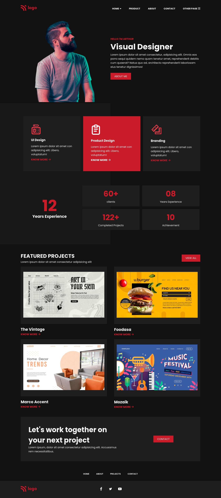

# Project15 [live link](https://css-projects-15.netlify.app/)

## By - Karan Chauhan

- CSS property I learned in this project
    - use of FontAwesome icon in pseudo element
    - `filter` property
    - flexbox
    - apply backgound color to half of the div

## Time taken to complete this project
    - 7 hours

## Screenshot
